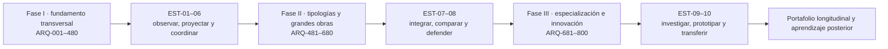

# Mapa de dependencias del aprendizaje

El mapa permite responder tres preguntas: qué estudiar antes, qué evidencia producir ahora y dónde se reutiliza después. No obliga a una duración única ni convierte la numeración en semestres.



## Cadena común

```text
PRERREQUISITO → CLASE → PRÁCTICA → EVIDENCIA → PROYECTO
→ COMPETENCIA → RUTA DE ESPECIALIZACIÓN → TRANSFERENCIA
```

Cada clase declara prerrequisitos y dependencias en su bloque `Decisión pedagógica y posición curricular`. El registro reproducible de las 800 cadenas vive en `data/pedagogical-decisions-generated.json`; CI comprueba que todos los identificadores existan.

## Progresión de capacidad

| Tramo | Acción dominante | Evidencia típica |
|---|---|---|
| Partes 01–04 | observar, comprender, representar | mapa, levantamiento, programa y primera propuesta |
| Partes 05–18 | contextualizar, analizar, diseñar | argumento histórico, sitio, alternativas y prueba de uso |
| Partes 19–38 | medir, calcular, simular, coordinar | modelo, detalle, balance, escenario y revisión especializada |
| Partes 39–48 | documentar, construir, evaluar, gestionar | expediente, costo, secuencia, recepción y posocupación |
| Partes 49–68 | transferir e integrar por tipología | anteproyecto complejo, interfaces y continuidad operacional |
| Partes 69–74 | investigar, programar, auditar y prototipar | protocolo, código, modelo, uso de IA y prototipo 1:1 |
| Partes 75–80 | especializar, innovar y defender | política, red territorial, adaptación, transformación y proyecto final |

## Checkpoints verticales

| Después de | Taller | Función |
|---:|---|---|
| Parte 04 | EST-01 | convertir observación en problema y representación |
| Parte 14 | EST-02 | integrar sitio, historia, programa y alternativas |
| Parte 18 | EST-03 | probar vivienda, cuidado e inclusión |
| Parte 27 | EST-04 | coordinar materia, envolvente y detalle |
| Parte 38 | EST-05 | evaluar desempeño y multirriesgo |
| Parte 47 | EST-06 | documentar, contratar, construir y operar |
| Parte 58 | EST-07 | resolver continuidad de una tipología compleja |
| Parte 68 | EST-08 | defender tesis y portafolio del núcleo ampliado |
| Parte 74 | EST-09 | investigar, modelar y prototipar con tecnología avanzada |
| Parte 80 | EST-10 | transferir una especialización a un proyecto interdisciplinario |

## Reglas de dependencia

- Una flecha significa que la evidencia anterior se reutiliza; proximidad numérica por sí sola no demuestra prerrequisito.
- Una ruta selecciona partes del programa, pero no elimina nivelación cuando el diagnóstico revela una brecha.
- Un parámetro de un caso no viaja a otro proyecto sin nueva evidencia; se transfiere el método.
- La Fase III presupone el núcleo común o evidencia equivalente y nunca sustituye atribuciones de especialistas.
- Toda dependencia crítica debe poder recorrerse hacia atrás desde el criterio de aceptación hasta la fuente.
